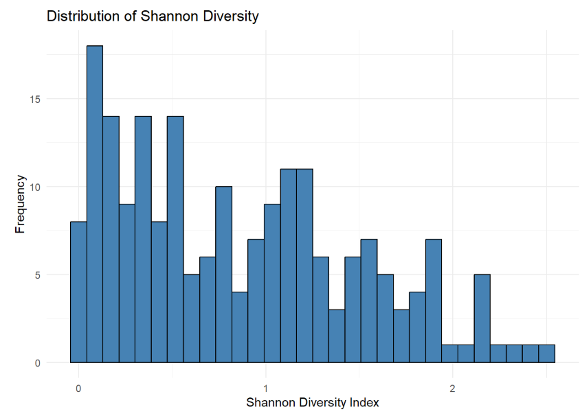
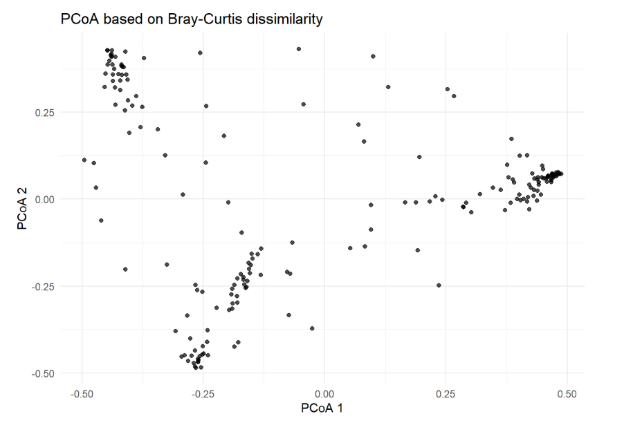
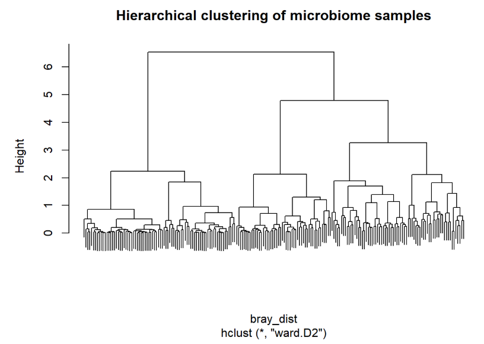
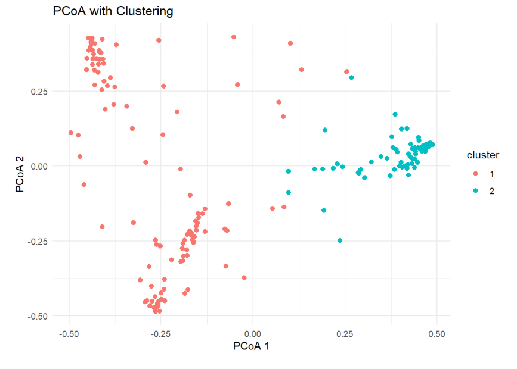

# Metagenomics Analysis of the ISALA Vaginal Microbiome Dataset

This repository contains an exploratory metagenomics analysis of vaginal microbiome data from the **ISALA citizen science project**. Using **16S rRNA sequencing** data, the project investigates microbial diversity and identifies groups of individuals with similar vaginal microbiota compositions through ordination and clustering techniques.

# Author:

**Mateus Auza Cruz & Dorian Napolitano**

## Repository Structure

```text
metagenomics/
├── figures/
│   ├── dendrogram.png
│   ├── pcoa-bray-curtis.png
│   ├── pcoa-clusters.png
│   └── shannon-diversity.png
├── README.md
├── code.qmd
├── isala_subset.Rds
└── metagenomics-report.html
```

## Dataset

The dataset (`isala_subset.Rds`) is a **SummarizedExperiment** object containing **16S rRNA sequencing counts** from **200 randomly selected vaginal microbiome samples** collected as part of the ISALA citizen science project.

The dataset includes:

- A microbial abundance count matrix
- Sample metadata
- Experimental information

## Objectives

This project aims to:

- Explore the structure of the microbiome dataset.
- Characterize microbial diversity across samples.
- Compute alpha and beta diversity metrics.
- Identify groups of individuals with similar microbiome compositions.
- Visualize microbial community structure using ordination and clustering techniques.

## Methods

The analysis includes:

- Exploratory data analysis
- Sequencing depth assessment
- Taxa richness analysis
- Alpha diversity:
  - Richness
  - Shannon Index
  - Simpson Index
- Bray–Curtis dissimilarity
- Principal Coordinates Analysis (PCoA)
- Hierarchical clustering (Ward's method)
- Silhouette analysis for selecting the optimal number of clusters

## Main Results

- **200 vaginal microbiome samples** were analyzed.
- Approximately **70%** of the abundance matrix consists of zero values, reflecting the high sparsity typical of microbiome datasets.
- Most samples contain between **12 and 24 detected taxa**, indicating moderate variability in microbial richness.
- Shannon diversity values suggest that many microbial communities are dominated by only a few taxa.
- Bray–Curtis PCoA reveals substantial differences in microbial community composition between individuals.
- Hierarchical clustering identifies **two major microbiome clusters**, suggesting the presence of distinct vaginal microbial community structures.

## Figures

### Shannon Diversity Distribution

Distribution of Shannon diversity across all samples.



---

### Principal Coordinates Analysis (PCoA)

Ordination of samples based on Bray–Curtis dissimilarity.



---

### Hierarchical Clustering

Hierarchical clustering of microbiome samples using Ward's linkage.



---

### PCoA with Cluster Assignments

PCoA visualization with samples colored according to the two identified clusters.



## Files

| File | Description |
|------|-------------|
| `code.qmd` | Quarto source code for the complete analysis |
| `metagenomics-report.html` | Rendered HTML report |
| `isala_subset.Rds` | ISALA microbiome dataset |
| `figures/` | Figures generated during the analysis |
| `README.md` | Repository overview |

## Requirements

Required R packages:

- SummarizedExperiment
- vegan
- dplyr
- tidyr
- ggplot2
- gt
- cluster
- factoextra
- patchwork
- kableExtra

Install the required packages:

```r
if (!require("BiocManager"))
    install.packages("BiocManager")

BiocManager::install("SummarizedExperiment")

install.packages(c(
  "vegan",
  "dplyr",
  "tidyr",
  "ggplot2",
  "gt",
  "cluster",
  "factoextra",
  "patchwork",
  "kableExtra"
))
```

## Running the Analysis

Render the Quarto document using:

```bash
quarto render code.qmd
```

or open `code.qmd` in **RStudio** and click **Render**.

## Conclusion

The exploratory and diversity analyses reveal substantial variability in vaginal microbiome composition across individuals. While alpha diversity varies moderately among samples, beta diversity analyses demonstrate clear differences in microbial community composition. Hierarchical clustering identified **two major microbiome groups**, supporting the existence of distinct vaginal microbial community structures within the ISALA dataset. These findings provide a foundation for future studies investigating the microbial taxa and host or environmental factors associated with these community profiles.
