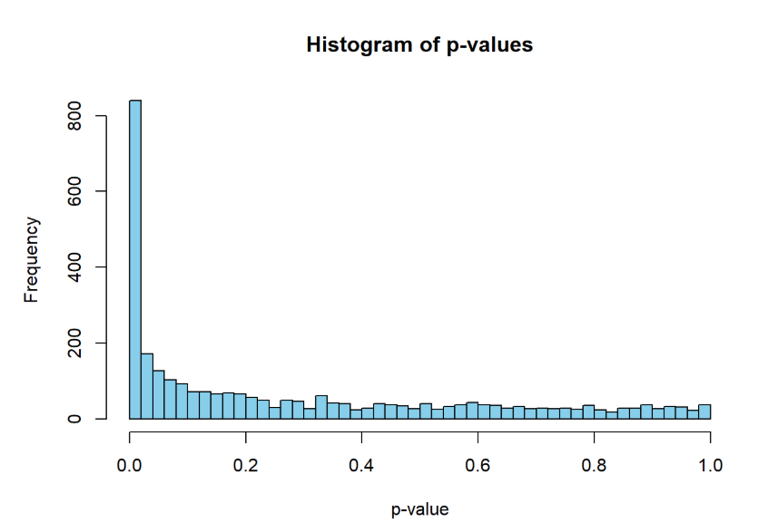
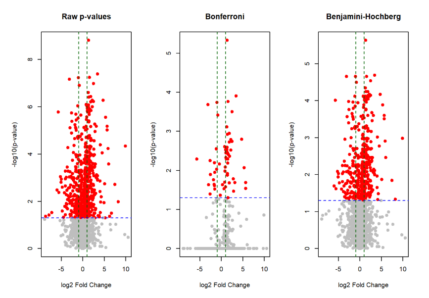

# Multiple Testing Analysis of Leukemia Gene Expression

This repository contains a multiple hypothesis testing analysis of a gene expression dataset comparing **Acute Lymphoblastic Leukemia (ALL)** and **Acute Myeloid Leukemia (AML)**. The analysis is implemented in **R** using a `SummarizedExperiment` object and demonstrates the application of multiple testing correction methods in genomic studies.

## Author:

**Mateus Auza Cruz**

## Repository Structure

```text
multiple-testing/
├── figures/
│   ├── p-value-histogram.png
│   └── volcano-plot.png
├── Gollub_SE.rds
├── README.md
├── code.qmd
└── multiple-testing-report.html
```

## Dataset

The dataset (`Gollub_SE.rds`) contains microarray gene expression measurements from leukemia patients.

- **Genes:** 3,051
- **Samples:** 38
- **Groups:**
  - Acute Lymphoblastic Leukemia (ALL)
  - Acute Myeloid Leukemia (AML)

## Objectives

The project aims to:

- Explore the structure of the gene expression dataset.
- Compare expression profiles between ALL and AML samples.
- Perform gene-wise statistical hypothesis tests.
- Investigate the distribution of p-values.
- Apply multiple testing correction methods.
- Visualize differential expression using volcano plots.

## Methods

The analysis includes:

- Exploratory data analysis
- Principal Component Analysis (PCA)
- Welch two-sample t-tests for each gene
- Multiple testing corrections:
  - Bonferroni
  - Šidák
  - Benjamini–Hochberg (False Discovery Rate)

## Main Results

A total of **3,051** hypothesis tests were performed.

| Method | Significant Genes |
|---------|------------------:|
| Raw p-values | 1,078 |
| Bonferroni | 103 |
| Šidák | 103 |
| Benjamini–Hochberg | 695 |

The Benjamini–Hochberg procedure provides the best balance between statistical power and false discovery rate control, making it well suited for high-dimensional genomic analyses.

## Figures

### P-value Histogram

Shows the distribution of gene-wise p-values, with a strong enrichment near zero indicating substantial differential expression.




### Volcano Plot

Displays log2 fold change versus −log10(p-value) for:

- Raw p-values
- Bonferroni-adjusted p-values
- Benjamini–Hochberg-adjusted p-values




## Files

| File | Description |
|------|-------------|
| `code.qmd` | Quarto source code for the complete analysis |
| `multiple-testing-report.html` | Rendered HTML report |
| `Gollub_SE.rds` | Gene expression dataset |
| `figures/p-value-histogram.png` | Histogram of p-values |
| `figures/volcano-plot.png` | Volcano plots after multiple testing corrections |

## Requirements

Required R packages:

```r
install.packages("readr")
install.packages("ggplot2")

if (!require("BiocManager"))
    install.packages("BiocManager")

BiocManager::install("SummarizedExperiment")
```

## Running the Analysis

Render the Quarto document using:

```bash
quarto render code.qmd
```

or open `code.qmd` in RStudio and click **Render**.

## Conclusion

The analysis provides strong evidence of differential gene expression between ALL and AML samples. While Bonferroni and Šidák corrections are highly conservative, the Benjamini–Hochberg procedure retains substantially more biologically meaningful discoveries while controlling the false discovery rate, making it the preferred approach for high-dimensional gene expression studies.
