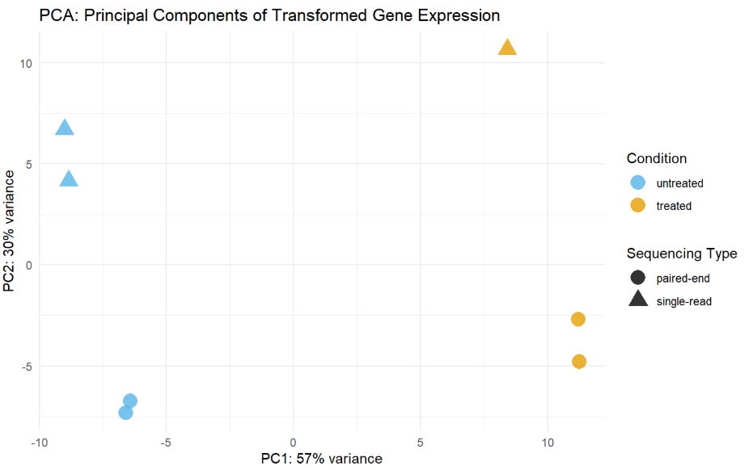
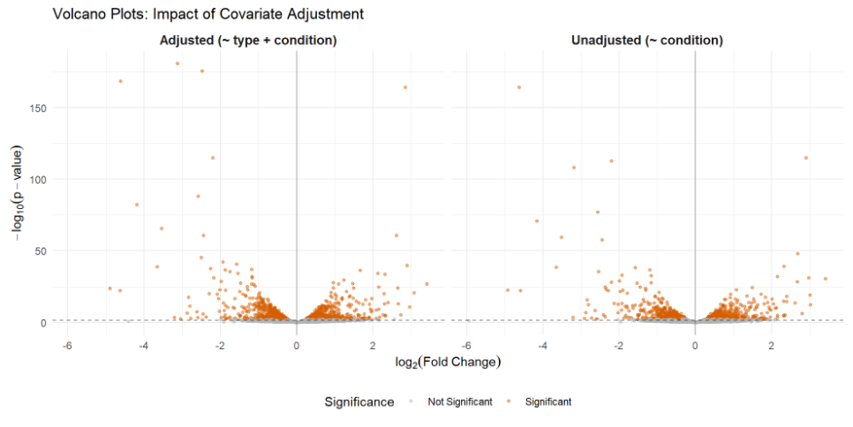
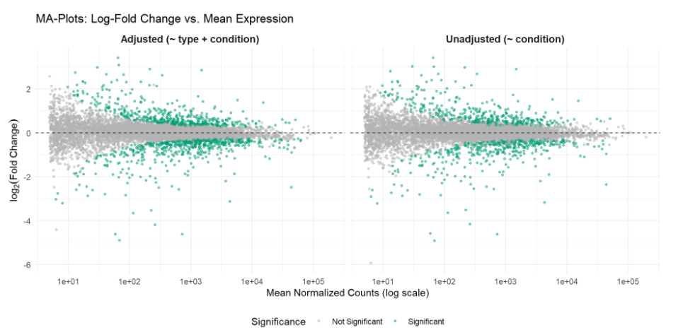

# Differential Expression Analysis of Bulk RNA-seq Data

Differential expression analysis of the **pasilla** RNA-seq dataset using **DESeq2** in R.

This project investigates the transcriptomic effects of **pasilla gene knockdown** in *Drosophila melanogaster* while evaluating the impact of sequencing protocol as a potential technical batch effect.

**Authors**

- Mateus Auza Cruz
- Dorian Napolitano

---

## Overview

RNA-seq experiments are often affected by technical sources of variation that may confound biological conclusions.

In this project, we compare two differential expression analyses:

- **Unadjusted model:** treatment effect only (`~ condition`)
- **Adjusted model:** treatment effect while controlling for sequencing protocol (`~ type + condition`)

The objective is to quantify how accounting for the sequencing type influences normalization, statistical power, and the identification of differentially expressed genes.

---

## Repository Structure

```text
.
├── code.qmd
├── transcriptomics-report.html
# Differential Expression Analysis of Bulk RNA-seq Data

Differential expression analysis of the **pasilla** RNA-seq dataset using **DESeq2** in R.

This project investigates the transcriptomic effects of **pasilla gene knockdown** in *Drosophila melanogaster* while evaluating the impact of sequencing protocol as a potential technical batch effect.

**Authors**

- Mateus Auza Cruz
- Dorian Napolitano

---

## Overview

RNA-seq experiments are often affected by technical sources of variation that may confound biological conclusions.

In this project, we compare two differential expression analyses:

- **Unadjusted model:** treatment effect only (`~ condition`)
- **Adjusted model:** treatment effect while controlling for sequencing protocol (`~ type + condition`)

The objective is to quantify how accounting for the sequencing type influences normalization, statistical power, and the identification of differentially expressed genes.

---

## Repository Structure

```text
.
├── code.qmd
├── code.html
├── figures/
├── README.md
└── docs/
```

---

## Dataset

This project uses the **pasilla** dataset distributed with the Bioconductor package **pasilla**.

The dataset contains RNA-seq counts from *Drosophila melanogaster* samples under two experimental conditions:

- untreated
- pasilla knockdown (treated)

along with metadata describing the sequencing protocol:

- paired-end
- single-read

No external download is required once the `pasilla` package is installed.

---

## Methods

The analysis includes

- Exploratory Data Analysis
- Library size comparison
- Principal Component Analysis (PCA)
- Variance Stabilizing Transformation (VST)
- Differential expression analysis with **DESeq2**
- Comparison of adjusted and unadjusted negative binomial GLMs
- Volcano plots
- MA-plots
- p-value distributions
- Identification of batch-effect-driven false positives

---

## R Packages

```r
library(DESeq2)
library(pasilla)
library(tidyverse)
library(gt)
library(ggrepel)
library(patchwork)
library(pheatmap)
library(magrittr)
```

---

## Running the Analysis

Open the Quarto document and render

```bash
quarto render code.qmd
```

or from R

```r
quarto::quarto_render("code.qmd")
```

The report automatically loads the **pasilla** dataset from the installed Bioconductor package.

---

# Results Preview

## Principal Component Analysis

*Shows that sequencing protocol is a major source of variation.*



---

## Volcano Plot

*Comparison of differential expression results between the adjusted and unadjusted models.*



---

## MA Plot

*Adjusted model reduces technical noise and removes low-count artifacts.*



---

## Main Findings

- Sequencing protocol introduces a substantial technical batch effect.
- PCA clearly separates samples according to sequencing type.
- Adjusting for sequencing protocol substantially increases statistical power.
- The adjusted model detects more differentially expressed genes.
- Several genes identified by the unadjusted model are revealed to be technical false positives.
- Modeling sequencing type as a covariate leads to more reliable biological conclusions.

---

## Report

The complete Quarto report is available as

- `code.qmd`
- `code.html`

---

## References

- Love, M. I., Huber, W., & Anders, S. (2014). *Moderated estimation of fold change and dispersion for RNA-seq data with DESeq2*. Genome Biology.
- Anders, S., & Huber, W. (2010). *Differential expression analysis for sequence count data*. Genome Biology.
- Bioconductor **DESeq2** package.
- Bioconductor **pasilla** dataset.

---

## License

This repository is intended for educational and academic purposes.
├── figures/
├── README.md
```

---

## Dataset

This project uses the **pasilla** dataset distributed with the Bioconductor package **pasilla**.

The dataset contains RNA-seq counts from *Drosophila melanogaster* samples under two experimental conditions:

- untreated
- pasilla knockdown (treated)

along with metadata describing the sequencing protocol:

- paired-end
- single-read

No external download is required once the `pasilla` package is installed.

---

## Methods

The analysis includes

- Exploratory Data Analysis
- Library size comparison
- Principal Component Analysis (PCA)
- Variance Stabilizing Transformation (VST)
- Differential expression analysis with **DESeq2**
- Comparison of adjusted and unadjusted negative binomial GLMs
- Volcano plots
- MA-plots
- p-value distributions
- Identification of batch-effect-driven false positives

---

## R Packages

```r
library(DESeq2)
library(pasilla)
library(tidyverse)
library(gt)
library(ggrepel)
library(patchwork)
library(pheatmap)
library(magrittr)
```

---

## Running the Analysis

Open the Quarto document and render

```bash
quarto render code.qmd
```

or from R

```r
quarto::quarto_render("code.qmd")
```

The report automatically loads the **pasilla** dataset from the installed Bioconductor package.

---

# Results Preview

## Principal Component Analysis

*Shows that sequencing protocol is a major source of variation.*


---

## Volcano Plot

*Comparison of differential expression results between the adjusted and unadjusted models.*


---

## MA Plot

*Adjusted model reduces technical noise and removes low-count artifacts.*


---

## Main Findings

- Sequencing protocol introduces a substantial technical batch effect.
- PCA clearly separates samples according to sequencing type.
- Adjusting for sequencing protocol substantially increases statistical power.
- The adjusted model detects more differentially expressed genes.
- Several genes identified by the unadjusted model are revealed to be technical false positives.
- Modeling sequencing type as a covariate leads to more reliable biological conclusions.

---

## Report

The complete Quarto report is available as

- `code.qmd`
- `code.html`

---

## References

- Love, M. I., Huber, W., & Anders, S. (2014). *Moderated estimation of fold change and dispersion for RNA-seq data with DESeq2*. Genome Biology.
- Anders, S., & Huber, W. (2010). *Differential expression analysis for sequence count data*. Genome Biology.
- Bioconductor **DESeq2** package.
- Bioconductor **pasilla** dataset.

---

## License

This repository is intended for educational and academic purposes.
